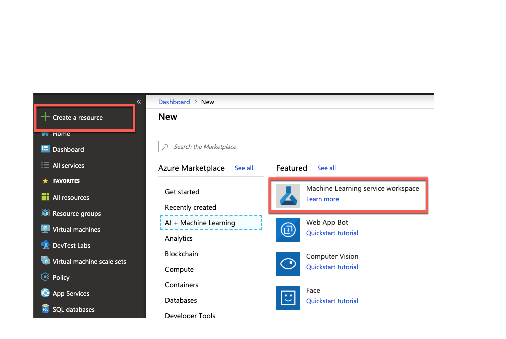
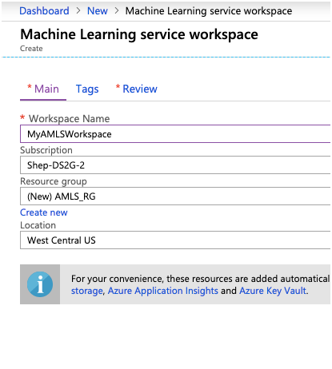
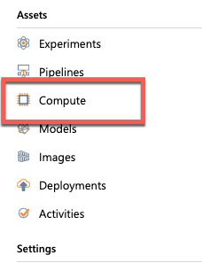
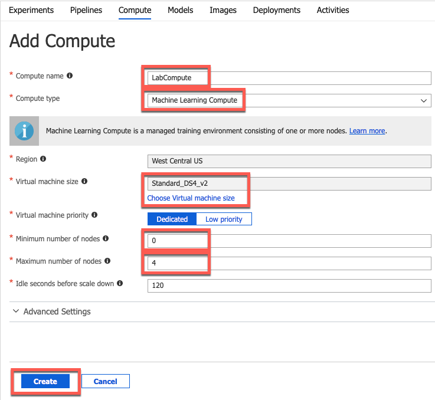

## Exercise 2 Create an Azure Machine Learning Workspace

### Overview

In this exercise, you will create an Azure Machine Learning Workspace and compute resources that will be needed for the remainder of the lab. 

###Time Estimate

60 minutes

### Task 1: Add an Azure Storage Account to the ARM template

1. Click on  **+ Create a resource > AI + Machine Learning > Machine Learning Workspace**

2.  In Provide a Workspace name in the **Workspace Name field.**

3. Choose the Lab Subscription.
 
4. Create a new Resource Group named **AMLS_RG**.

5. Choose a location near you.

    

6. Select Review and Create.

7. Select **Compute** under **Assets**.

    

8. Select **+ Add Compute**
   

9. On the **On the ADD Compute** page provide a name for the Compute Cluster.

10. Select **Machine Learning Compute** from the **Compute type** dropdown

11. Choose **Virtual Machine Size** of **DS4_V2**

12. Select **0** as the **Minimum number of nodes** 
    
13. Select **4** as the **Maximum number of nodes** 
    
14. Select **Create**
    

## Summary

 In this exercise, you created a Azure Machine Learning Service Workspace and compute.  

