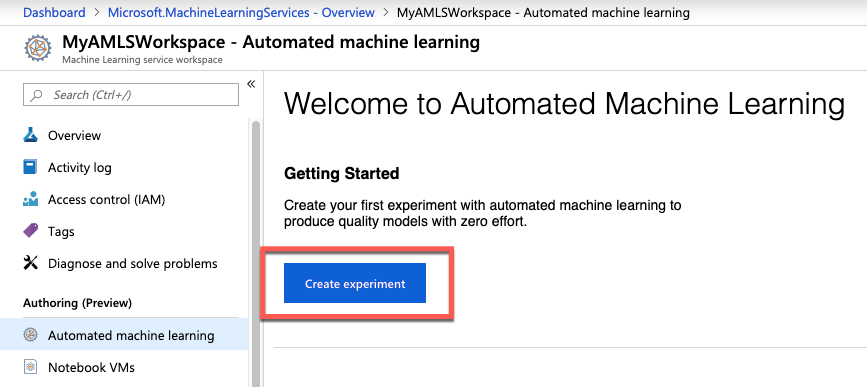
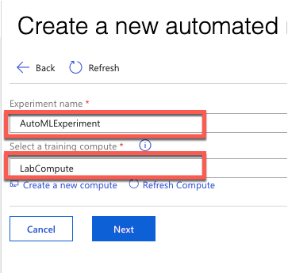
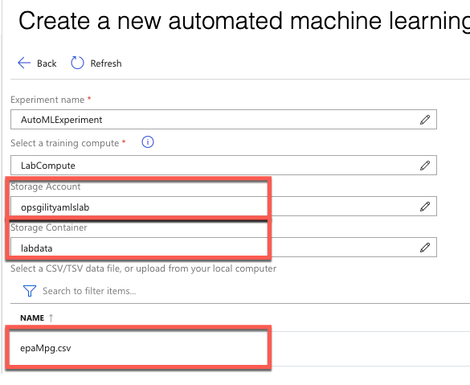
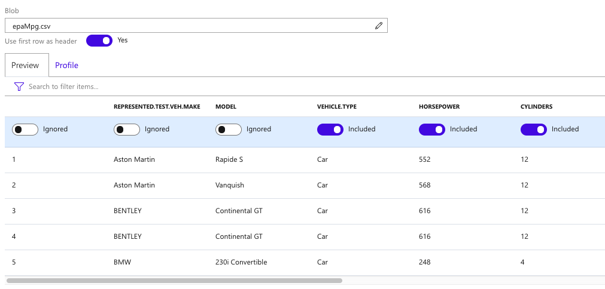
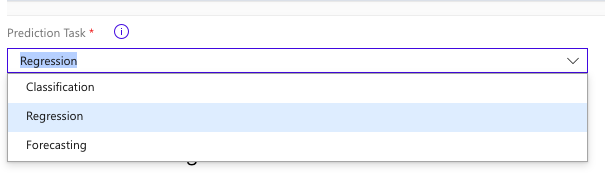
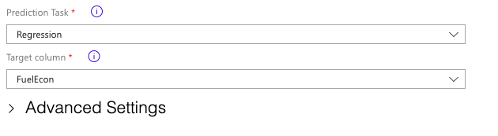
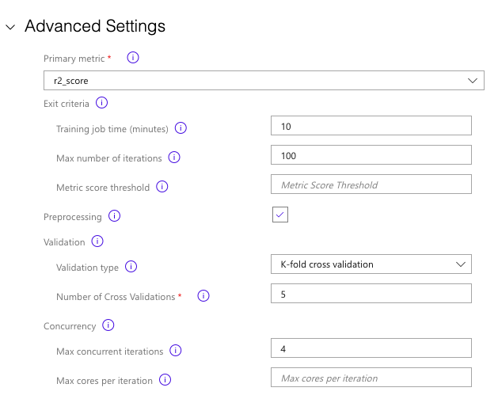
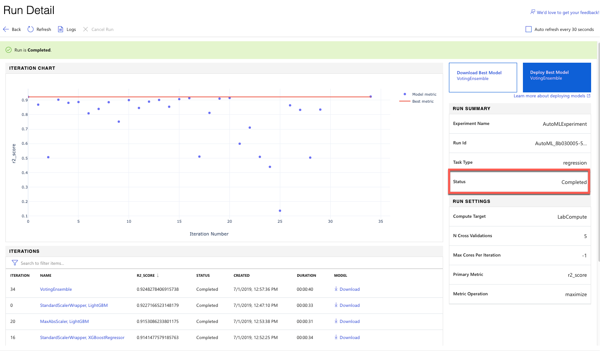

## Exercise 3 Create an Azure Machine Learning Automated Machine Learning Experiment

### Overview

In this exercise, you will create an Azure Machine Learning Automated Machine Learning  Experiment.

###Time Estimate

60 minutes

1. In the Azure Machine Learning Workspace under  **Authoring** select Automated Machine Learning and select **Create Experiment**

2. Provide a name for your **Experiment**

3. Select the **Compute** you created in the last exercise from the **Select training compute** drop down.

4. Under **Storage Account** select the Opsgility Lab Storage Account.

5. Select the **labdata** Storage Container.

6. Select the **epaMpg.csv** from the file list

The Column preview will display providing you the option to include or exclude specific columns in the dataset as well as provide you a preview of the date.  Take a moment to review the data.

7. Exclude the columns: **Column Number**, **Represented.Test.Veh.Make**, **Model**, **Tested.Transmission.Type**, **Test.Procedure.Description**, **Test.Fuel.Type.Description**.  These columns are redundant in this data as there is an associated code with each description, we will use the code for the model.
   

8. Under the **Prediction Task Dropdown select Regression**.  We will be using regression in this exercise since we want to predict the value of MPG. 

9. Under **Target Column** select FuelEcon since that represents MPG for this data set.

For this experiment we will be using R-Square as the metric to measure the model.  AutoML will create multiple models with multiple column transformations in a search for the best R-Square.  

10.   Select **Advanced Settings** Modify your settings to match the following.  There is an option for **Blocked Algorithms**, we will not be removing any algorithms from the experiment.  Select **Start** to begin the run.

11.   Monitor the Run Detail Page Until the Status shows completed. 

Evaluate the iterations, which model performed the best with the highest R-Squared, Drill into the model, how does the predicted vs. true look, do you think this would be a good model?  Where does the model start to fall off? 

Look at a few different models comparing some of the other metrics as well, compare the root mean squared error, the spearman correlation, is Voting Ensemble still the best?

